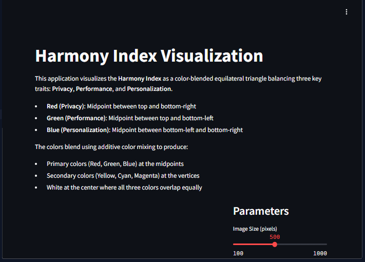

# Marshall Triangle Visualization

A sophisticated Python-based visualization module for rendering the Harmony Index as an interactive, color-blended equilateral triangle that dynamically balances Privacy, Performance, and Personalization metrics.

## Overview

The Marshall Triangle represents a novel visualization approach to triadic balance between key traits:
- **Privacy (Red)** - Located at the midpoint between top and bottom-right vertices
- **Performance (Green)** - Located at the midpoint between top and bottom-left vertices
- **Personalization (Blue)** - Located at the midpoint between bottom-left and bottom-right vertices

This geometric arrangement produces secondary colors at vertices:
- **Yellow** (Privacy + Performance) at the top vertex
- **Magenta** (Privacy + Personalization) at the bottom-left vertex
- **Cyan** (Performance + Personalization) at the bottom-right vertex

When all traits are balanced, the center of the triangle appears white.

## Key Features

- **Dynamic State Vector**: Adjust the strength of each trait through interactive sliders
  

- **Triadic Calibration**: Set any point as the new "balance point" (white center)
  

- **State Management**: Save and load Marshall States with custom visualization parameters

- **Rendering Options**: Choose between Gaussian and Inverse-Square falloff functions for different blending effects

- **Interactive UI**: User-friendly Streamlit interface with tabbed navigation and custom styling

## Technical Architecture

The project is structured around three core components:

1. **HarmonyIndex Class**: The rendering engine that handles all geometric calculations, color blending, and image generation.

2. **Streamlit Interface**: Provides an interactive web UI for manipulating the visualization parameters and saving/loading states.

3. **Persistence Layer**: Combines SQLite database and file-based storage for reliable state management.

For more detailed technical information, see [docs/TECHNICAL.md](docs/TECHNICAL.md).

## License

Copyright (c) 2025 Paul Warrington Marshall. All Rights Reserved.
